# iOS-UI之简易图表——饼图(扇形图)、柱状图、折(曲)线图<br>
先来看看效果<br>
1.饼图(扇形图)<br>
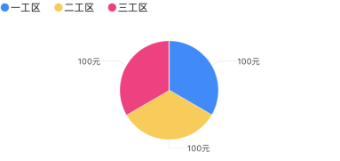 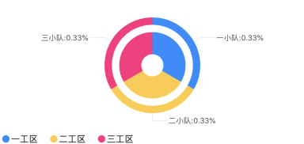
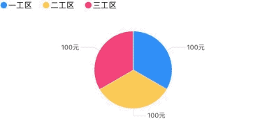

2.柱状图<br>
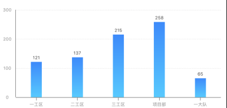 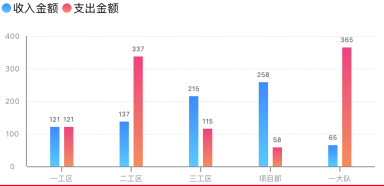
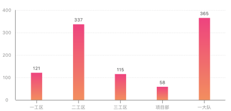 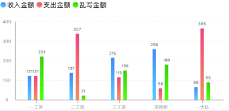
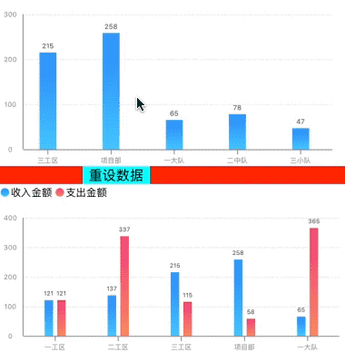

3.折线图<br>
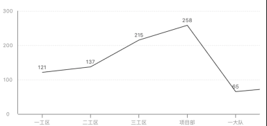 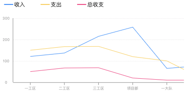
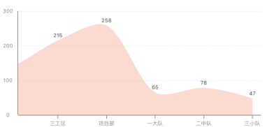 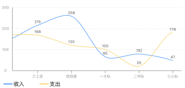
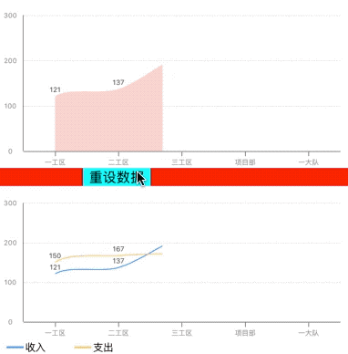 

样子粗糙，见笑了。
现在来看看实现过程
## 一、饼图(扇形图)
### 1.实现思路
实现思路其实很简单，首先算传入数据数组的数据总和，然后根据每个数据占比来乘以2π，得到每个数据的弧度，然后在循环中利用UIBezierPath的addArcWithCenter: radius: startAngle: endAngle: clockwise:方法设置路径，从圆顶点，即-π/2处开始,用CAShapeLayer画出子扇区，设置好颜色和半径就完成了。
### 2.核心代码
```Objective-C
CGFloat startAngle = -M_PI_2;
for (int i = 0; i < self.pieDataArray.count; i++) {
    NSString *num = self.pieDataArray[i];
    UIBezierPath *path = [UIBezierPath bezierPath];
    [path addArcWithCenter:CGPointMake(pieView.bounds.size.width / 2, pieView.bounds.size.height / 2) radius:self.radius startAngle:startAngle endAngle:startAngle + [num floatValue] / total * M_PI * 2 clockwise:YES];
    [path addLineToPoint:CGPointMake(pieView.bounds.size.width / 2, pieView.bounds.size.height / 2)];// 圆心
    [[self colorWithHexString:self.colorArray[i]] setStroke];
    [[self colorWithHexString:self.colorArray[i]] setFill];
    [path stroke];
    [path fill];
    
    CAShapeLayer *layer = [CAShapeLayer layer];
    layer.path = path.CGPath;
    layer.strokeColor = [UIColor whiteColor].CGColor; // 描边颜色
    layer.fillColor = [self colorWithHexString:self.colorArray[i]].CGColor; // 背景填充色
    [pieView.layer addSublayer:layer];
    
    startAngle = startAngle + [num floatValue] / total * M_PI * 2 ;
}
```
为了实现动画效果，需要在画出子扇区之前，设置一层遮罩，同样也可以用UIBezierPath和CAShapeLayer来实现，并将这层遮罩设置为圆
```Objective-C
UIBezierPath *bgPath = [UIBezierPath bezierPathWithArcCenter:CGPointMake(pieView.bounds.size.width / 2, pieView.bounds.size.height / 2) radius:radius / 2 startAngle:-M_PI_2 endAngle:M_PI_2 * 3 clockwise:YES];
CAShapeLayer *bgLayer = [CAShapeLayer layer];
bgLayer.fillColor = [UIColor clearColor].CGColor;
bgLayer.strokeColor = [UIColor lightGrayColor].CGColor;
bgLayer.strokeStart = 0;
bgLayer.strokeEnd = 1;
bgLayer.zPosition = 1;
bgLayer.lineWidth = radius;
bgLayer.path = bgPath.CGPath;
```
并且务必在设置动画之前设置遮罩
```Objective-C
pieView.layer.mask = bgLayer;
```
然后添加上动画
```Objective-C
// 动画
CABasicAnimation *strokeAnimation = [CABasicAnimation animationWithKeyPath:@"strokeEnd"];
strokeAnimation.fromValue = @0;// 起始值
strokeAnimation.toValue = @1;// 结束值
strokeAnimation.duration = 1;// 动画持续时间
strokeAnimation.repeatCount = 1;// 重复次数
strokeAnimation.timingFunction = [CAMediaTimingFunction functionWithName:kCAMediaTimingFunctionEaseInEaseOut];
strokeAnimation.removedOnCompletion = YES;
[bgLayer addAnimation:strokeAnimation forKey:@"pieAnimation"];
```
这样一个单层饼图就完成了。

多层饼图的适用环境，内层饼图数据与外层饼图数据有包含关系，比如内层中的一工区包含外层的一小队、二小队等。

多层饼图的内层实现和单层饼图类似，外层实现是只利用UIBezierPath画一个圆弧轨迹，并设置线宽lineWidth和内层没有重合部分就行了。

## 二、柱状图
### 1.实现思路
首先找到数据中的最大值，向上取整十或整百或整千并设置为Y轴最大值，然后在Y轴右侧放置一个scrollView（当数据超过5组时可以滚动），然后根据传入数据的分组标题，设置X轴和X轴分组标题，然后根据每个具体数据的值，算出柱顶点坐标，然后用UIBezierPath来设置柱路径，再画出柱子
### 2.核心代码
```Objective-C
NSString *num = self.dataArray[i];
CGFloat columnHeight = (self.yAxisView.bounds.size.height - 20) * [num intValue] / maxNum;
UIBezierPath *columnPath = [UIBezierPath bezierPath];
[columnPath moveToPoint:CGPointMake(dataView.bounds.size.width / 2, dataView.bounds.size.height)];
[columnPath addLineToPoint:CGPointMake(dataView.bounds.size.width / 2, dataView.bounds.size.height - columnHeight)];
columnPath.lineWidth = [self.columnWidth intValue];
[[self colorWithHexString:self.columnColor] setStroke];
[[self colorWithHexString:self.columnColor] setFill];
[columnPath stroke];
[columnPath fill];
/*
    在这后面完成柱子的绘制（分渐变色和非渐变色讨论）
*/
```
当柱子不是渐变色时，用CAShapeLayer，代码如下：
```Objective-C
CAShapeLayer *columnLayer = [CAShapeLayer layer];
columnLayer.path = columnPath.CGPath;
columnLayer.strokeColor = [self colorWithHexString:self.columnColor].CGColor;// 描边颜色
columnLayer.fillColor = [self colorWithHexString:self.columnColor].CGColor;
columnLayer.lineWidth = [self.columnWidth intValue];
[dataView.layer addSublayer:columnLayer];
```
当柱子是渐变色时，用CAGradientLayer，代码如下：
```Objective-C
CAGradientLayer *columnGradientLayer = [CAGradientLayer layer];
columnGradientLayer.frame = CGRectMake(dataView.bounds.size.width / 2 - [self.columnWidth intValue] / 2, dataView.bounds.size.height - columnHeight, [self.columnWidth intValue], columnHeight);
columnGradientLayer.colors = @[(__bridge id)[self colorWithHexString:self.columnGradientColorArray[0]].CGColor,
                                (__bridge id)[self colorWithHexString:self.columnGradientColorArray[1]].CGColor];
columnGradientLayer.locations = @[@(0.0),@(1.0)];// 颜色变化位置
columnGradientLayer.startPoint = CGPointMake(0, 0);
columnGradientLayer.endPoint = CGPointMake(0, 1);
[dataView.layer addSublayer:columnGradientLayer];
```
同样的，如果需要实现柱子自下而上的动画，也需要设置一个背景来遮罩
```Objective-C
UIBezierPath *bgPath = [UIBezierPath bezierPath];
[bgPath moveToPoint:CGPointMake(dataView.bounds.size.width / 2, dataView.bounds.size.height)];
[bgPath addLineToPoint:CGPointMake(dataView.bounds.size.width / 2, 0)];
bgPath.lineWidth = groupWidth;

CAShapeLayer *bgLayer = [CAShapeLayer layer];
bgLayer.fillColor = [UIColor clearColor].CGColor;
bgLayer.strokeColor = [UIColor lightGrayColor].CGColor;
bgLayer.strokeStart = 0;
bgLayer.strokeEnd = 1;
bgLayer.zPosition = 1;
bgLayer.lineWidth = groupWidth;
bgLayer.path = bgPath.CGPath;
dataView.layer.mask = bgLayer;
```
再加上动画
```Objective-C
CABasicAnimation *strokeAnimation = [CABasicAnimation animationWithKeyPath:@"strokeEnd"];
strokeAnimation.fromValue = @0;// 起始值
strokeAnimation.toValue = @1;// 结束值
strokeAnimation.duration = 1;// 动画持续时间
strokeAnimation.repeatCount = 1;// 重复次数
strokeAnimation.timingFunction = [CAMediaTimingFunction functionWithName:kCAMediaTimingFunctionEaseInEaseOut];
strokeAnimation.removedOnCompletion = YES;
[bgLayer addAnimation:strokeAnimation forKey:@"pieAnimation"];
```
一个单柱的柱状图就实现了，如果要实现多柱（最多4柱，因为多了不好看，嘻嘻~），也不复杂，大概实现思路和单柱一样，只有一点就是需要调整每组柱体的x坐标在每组的中点即可。

## 三、折线图
### 1.实现思路
单纯的折线图实现思路起始很简单，就是在背景上利用循环，算出每个数据的点坐标，然后用UIBezierPath和CAShapeLayer来画出每个点之前的直线就行了。

然而，如果要把折线换成平滑的曲线，这就不好实现了，需要用到UIBezierPath的addCurveToPoint: controlPoint1: controlPoint2:方法了，除了需要传入数据点，还需要传入两个控制点，因为贝塞尔曲线是利用两个控制点来确定一段曲线路径的（大致内容参考自：<https://www.jianshu.com/p/c883fbf52681>，感谢大佬的分享），但是我依然不知道这两个控制点怎么来确定，毕竟这太高数了（参考自：<https://wenku.baidu.com/view/c790f8d46bec0975f565e211.html>），我又在网上搜了一下，有现成的（原谅我这个白嫖党）<https://www.jianshu.com/p/c33081adce28>(再次感谢大佬)，于是乎借(cmd+c)鉴(cmd+v)来用。在曲线找点开始之前，先另外创建一个可变数组(NSMutableArray)pointArray，先在这个数组第一个元素的位置保存上原点(0,0)的坐标，用来确定第一段曲线，然后将数据（此时已经转化成CGPointValue)挨个存入pointArray，最后再加上曲线末端向右偏移半个dataView的宽度的距离在x轴上的坐标，用来确定最后一段曲线。最后用CAShapelayer把曲线画出来。
### 2.核心代码
单纯的折线时
```Objective-C
UIBezierPath *dataPath = [UIBezierPath bezierPath];
dataPath.lineWidth = self.lineWidth;
[[self colorWithHexString:self.lineColor andAlpha:1.0] setStroke];
[[self colorWithHexString:self.lineColor andAlpha:1.0] setFill];
[dataPath stroke];
[dataPath fill];
for (int i = 0; i < self.dataArray.count; i++) {
    // 具体数据
    NSString *num = self.dataArray[i];
    CGFloat pointHeight = self.dataView.bounds.size.height - (self.dataView.bounds.size.height - 20) * [num intValue] / maxNum;
    [dataPath addLineToPoint:CGPointMake(groupWidth / 2 + groupWidth * i, pointHeight)];
}
CAShapeLayer *dataLayer = [CAShapeLayer layer];
dataLayer.path = dataPath.CGPath;
dataLayer.strokeColor = [self colorWithHexString:self.lineColor andAlpha:1.0].CGColor;
dataLayer.fillColor = nil;
dataLayer.lineWidth = self.lineWidth;
[self.dataView.layer addSublayer:dataLayer];
```
平滑曲线时
```Objective-C
UIBezierPath *dataPath = [UIBezierPath bezierPath];
dataPath.lineWidth = self.lineWidth;
[[self colorWithHexString:self.lineColor andAlpha:1.0] setStroke];
[[self colorWithHexString:self.lineColor andAlpha:1.0] setFill];
[dataPath stroke];
[dataPath fill];
 
[self.pointArray removeAllObjects];
// 起始点
[self.pointArray addObject:[NSValue valueWithCGPoint:CGPointMake(0, self.dataView.bounds.size.height)]];
CGFloat groupWidth = self.scrollView.bounds.size.width / 5;
for (int i = 0; i < self.dataArray.count; i++) {
    NSString *num = self.dataArray[i];
    CGFloat pointHeight = self.dataView.bounds.size.height - (self.dataView.bounds.size.height - 20) * [num intValue] / maxNum;
    [self.pointArray addObject:[NSValue valueWithCGPoint:CGPointMake(groupWidth / 2 + groupWidth * i, pointHeight)]];
}

// 添加结束点
[self.pointArray addObject:[NSValue valueWithCGPoint:CGPointMake(self.dataView.bounds.size.width, self.dataView.bounds.size.height)]];
for (int i = 0; i < self.dataArray.count - 1; i++) {
    CGPoint p1 = [self.pointArray[i] CGPointValue];
    CGPoint p2 = [self.pointArray[i+1] CGPointValue];
    CGPoint p3 = [self.pointArray[i+2] CGPointValue];
    CGPoint p4 = [self.pointArray[i+3] CGPointValue];
    if (i == 0) {
        if (self.isFillWithColor) {
            [dataPath moveToPoint:CGPointMake(groupWidth / 2, self.dataView.bounds.size.height)];
            [dataPath addLineToPoint:p2];
        } else {
            [dataPath moveToPoint:p2];
            [dataPath addLineToPoint:CGPointMake(groupWidth / 2, self.dataView.bounds.size.height)];
        }
    }
    [self getControlPointOfBezierPath:dataPath andPointx0:p1.x andy0:p1.y x1:p2.x andy1:p2.y x2:p3.x andy2:p3.y x3:p4.x andy3:p4.y];
CAShapeLayer *dataLayer = [CAShapeLayer layer];
dataLayer.path = dataPath.CGPath;
dataLayer.strokeColor = [self colorWithHexString:self.lineColor andAlpha:1.0].CGColor;
dataLayer.fillColor = nil;//[self colorWithHexString:self.lineColor].CGColor;
dataLayer.lineWidth = self.lineWidth;
[self.dataView.layer addSublayer:dataLayer];
```
其中，曲线控制点的计算方法getControlPointOfBezierPath: andPointx0:andy0: x1: andy1: x2: andy2: x3:andy3实现为
```Objective-C
/**
 传入四个点求两个控制点 （画2，3之间的曲线，需要传入1，2，3，4的坐标）
 参考自：https://www.jianshu.com/p/c33081adce28
 实在是看球不懂
 */
- (void)getControlPointOfBezierPath:(UIBezierPath *)bezierPath
                         andPointx0:(CGFloat)x0 andy0:(CGFloat)y0
                                 x1:(CGFloat)x1 andy1:(CGFloat)y1
                                 x2:(CGFloat)x2 andy2:(CGFloat)y2
                                 x3:(CGFloat)x3 andy3:(CGFloat)y3 {
    CGFloat smooth_value = 0.6;
    CGFloat ctrl1_x;
    CGFloat ctrl1_y;
    CGFloat ctrl2_x;
    CGFloat ctrl2_y;
    CGFloat xc1 = (x0 + x1) /2.0;
    CGFloat yc1 = (y0 + y1) /2.0;
    CGFloat xc2 = (x1 + x2) /2.0;
    CGFloat yc2 = (y1 + y2) /2.0;
    CGFloat xc3 = (x2 + x3) /2.0;
    CGFloat yc3 = (y2 + y3) /2.0;
    CGFloat len1 = sqrt((x1-x0) * (x1-x0) + (y1-y0) * (y1-y0));
    CGFloat len2 = sqrt((x2-x1) * (x2-x1) + (y2-y1) * (y2-y1));
    CGFloat len3 = sqrt((x3-x2) * (x3-x2) + (y3-y2) * (y3-y2));
    CGFloat k1 = len1 / (len1 + len2);
    CGFloat k2 = len2 / (len2 + len3);
    CGFloat xm1 = xc1 + (xc2 - xc1) * k1;
    CGFloat ym1 = yc1 + (yc2 - yc1) * k1;
    CGFloat xm2 = xc2 + (xc3 - xc2) * k2;
    CGFloat ym2 = yc2 + (yc3 - yc2) * k2;
    ctrl1_x = xm1 + (xc2 - xm1) * smooth_value + x1 - xm1;
    ctrl1_y = ym1 + (yc2 - ym1) * smooth_value + y1 - ym1;
    ctrl2_x = xm2 + (xc2 - xm2) * smooth_value + x2 - xm2;
    ctrl2_y = ym2 + (yc2 - ym2) * smooth_value + y2 - ym2;
    
    [bezierPath addCurveToPoint:CGPointMake(x2, y2) controlPoint1:CGPointMake(ctrl1_x, ctrl1_y) controlPoint2:CGPointMake(ctrl2_x, ctrl2_y)];
}
```
当线条下面部分需要填充颜色时，需要在path里添加起始点在X轴上的投影的点坐标和结束点在X轴上的投影的点坐标，以保证路径是个闭合的图形，然后设置CAShapeLayer的fillColor（填充色）就可以了，完整判断填充色和平滑曲线的代码如下
```Objective-C
UIBezierPath *dataPath = [UIBezierPath bezierPath];
dataPath.lineWidth = self.lineWidth;
[[self colorWithHexString:self.lineColor andAlpha:1.0] setStroke];
[[self colorWithHexString:self.lineColor andAlpha:1.0] setFill];
[dataPath stroke];
[dataPath fill];

[self.pointArray removeAllObjects];
// 起始点
[self.pointArray addObject:[NSValue valueWithCGPoint:CGPointMake(0, self.dataView.bounds.size.height)]];
    
CGFloat groupWidth = self.scrollView.bounds.size.width / 5;
for (int i = 0; i < self.dataArray.count; i++) {
    // 具体数据
    NSString *num = self.dataArray[i];
    CGFloat pointHeight = self.dataView.bounds.size.height - (self.dataView.bounds.size.height - 20) * [num intValue] / maxNum;
    if (self.isSmooth) {// 是否为平滑曲线
           [self.pointArray addObject:[NSValue valueWithCGPoint:CGPointMake(groupWidth / 2 + groupWidth * i, pointHeight)]];
    } else {
        if (i == 0) {
               if (self.isFillWithColor) {
                [dataPath moveToPoint:CGPointMake(groupWidth / 2, self.dataView.bounds.size.height)];
                [dataPath addLineToPoint:CGPointMake(groupWidth / 2, pointHeight)];
            } else {
                [dataPath moveToPoint:CGPointMake(groupWidth / 2, pointHeight)];
            }
        } else if (i == self.dataArray.count - 1) {
            [dataPath addLineToPoint:CGPointMake(groupWidth / 2 + groupWidth * i, pointHeight)];
            if (self.isFillWithColor) {
                [dataPath addLineToPoint:CGPointMake(groupWidth / 2 + groupWidth * i, self.dataView.bounds.size.height)];
            }
        } else {
            [dataPath addLineToPoint:CGPointMake(groupWidth / 2 + groupWidth * i, pointHeight)];
        }
    }
}

if (self.isSmooth) {
    // 添加结束点
    [self.pointArray addObject:[NSValue valueWithCGPoint:CGPointMake(self.dataView.bounds.size.width, self.dataView.bounds.size.height)]];
    for (int i = 0; i < self.dataArray.count - 1; i++) {
        CGPoint p1 = [self.pointArray[i] CGPointValue];
        CGPoint p2 = [self.pointArray[i+1] CGPointValue];
        CGPoint p3 = [self.pointArray[i+2] CGPointValue];
        CGPoint p4 = [self.pointArray[i+3] CGPointValue];
        if (i == 0) {
            if (self.isFillWithColor) {
                [dataPath moveToPoint:CGPointMake(groupWidth / 2, self.dataView.bounds.size.height)];
                [dataPath addLineToPoint:p2];
            } else {
                [dataPath moveToPoint:p2];
                [dataPath addLineToPoint:CGPointMake(groupWidth / 2, self.dataView.bounds.size.height)];
            }
        }
        [self getControlPointOfBezierPath:dataPath andPointx0:p1.x andy0:p1.y x1:p2.x andy1:p2.y x2:p3.x andy2:p3.y x3:p4.x andy3:p4.y];
    }
    if (self.isFillWithColor) {
        [dataPath addLineToPoint:CGPointMake(groupWidth / 2 + groupWidth * (self.dataArray.count - 1), self.dataView.bounds.size.height)];
//      [dataPath addLineToPoint:CGPointMake(groupWidth / 2, self.dataView.bounds.size.height)];
    }
}
    
CAShapeLayer *dataLayer = [CAShapeLayer layer];
dataLayer.path = dataPath.CGPath;
if (self.isFillWithColor) {
    dataLayer.strokeColor = nil;//[self colorWithHexString:self.lineColor].CGColor;
    dataLayer.fillColor = [self colorWithHexString:self.fillColor  andAlpha:self.fillAlpha].CGColor;
} else {
    dataLayer.strokeColor = [self colorWithHexString:self.lineColor andAlpha:1.0].CGColor;
    dataLayer.fillColor = nil;//[self colorWithHexString:self.lineColor].CGColor;
}
dataLayer.lineWidth = self.lineWidth;
[self.dataView.layer addSublayer:dataLayer];
```
和之前两个图表相同，如果需要动画就要添加上背景遮罩
```Objective-C
UIBezierPath *bgPath = [UIBezierPath bezierPath];
[bgPath moveToPoint:CGPointMake(0, self.dataView.bounds.size.height / 2)];
[bgPath addLineToPoint:CGPointMake(self.dataView.bounds.size.width, self.dataView.bounds.size.height / 2)];
bgPath.lineWidth = self.dataView.bounds.size.height;
CAShapeLayer *bgLayer = [CAShapeLayer layer];
bgLayer.fillColor = [UIColor clearColor].CGColor;
bgLayer.strokeColor = [UIColor lightGrayColor].CGColor;
bgLayer.strokeStart = 0;
bgLayer.strokeEnd = 1;
bgLayer.zPosition = 1;
bgLayer.lineWidth = self.dataView.bounds.size.height;
bgLayer.path = bgPath.CGPath;
self.dataView.layer.mask = bgLayer;
```
加上动画
```Objective-C
CABasicAnimation *strokeAnimation = [CABasicAnimation animationWithKeyPath:@"strokeEnd"];
strokeAnimation.fromValue = @0;// 起始值
strokeAnimation.toValue = @1;// 结束值
strokeAnimation.duration = 1;// 动画持续时间
strokeAnimation.repeatCount = 1;// 重复次数
strokeAnimation.timingFunction = [CAMediaTimingFunction functionWithName:kCAMediaTimingFunctionEaseInEaseOut];
strokeAnimation.removedOnCompletion = YES;
[bgLayer addAnimation:strokeAnimation forKey:@"pieAnimation"];
```
一个单条折线图就完成了，如果需要多条折线图，实现方式也和实现单条类似，只是需要解析的数据数组是个二维数组，里面每个元素都是一条线的数据，外层数组有多少个元素就有多少条线，用循环绘制就可以了。

## 四、结束语
时间仓促，有许多不完善的地方，还请海涵，有什么问题可以联系我<br>
CSDN博客地址：<https://blog.csdn.net/guchuang2599/article/details/90231310>

